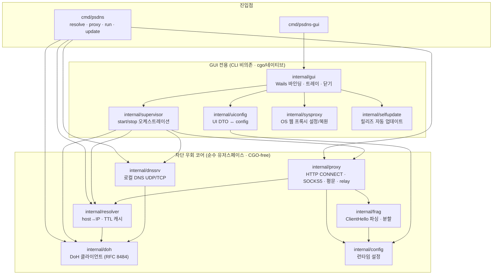
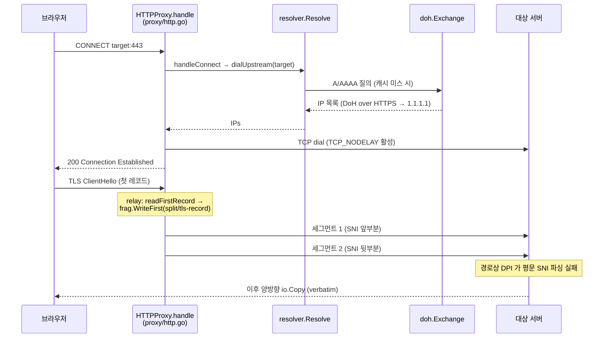
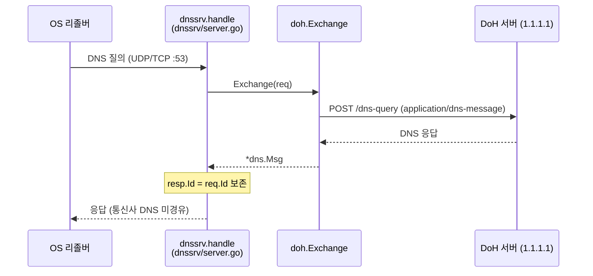

# 내부 구조

psdns 의 모듈 의존 관계와 요청 한 건이 처리되는 흐름을 시각화한다. 디렉터리별 한 줄 설명은 [README §구조](../README.md#구조)에 있고, 설계 *이유*(Why)는 [CLAUDE.md](../CLAUDE.md)에 있다 — 여기서는 **어떻게 연결되고 흐르는가**만 다룬다.

## 모듈 의존 관계

차단 우회 코어(`proxy`·`frag`·`resolver`·`dnssrv`·`doh`)는 순수 유저스페이스 소켓만 쓰며 `CGO_ENABLED=0` 으로 빌드된다. GUI 전용 묶음(Wails·트레이·시스템 프록시·자동 업데이트)은 CLI 바이너리로 새지 않도록 격리돼 있다.

## 흐름 (a): 브라우저 HTTPS → HTTP CONNECT 프록시 (DNS + SNI 동시 우회)

`proxy` 가 클라이언트↔업스트림 TCP 를 종단 분리하므로 업스트림으로 나가는 세그먼트 경계를 완전히 제어한다. 이름 해석은 프록시 내부에서 DoH 로 처리해 위조 DNS 를 거치지 않는다.

평문 HTTP(비-CONNECT)는 `handlePlain` 으로 분기해 origin-form 재작성 후 DoH 해석·릴레이만 한다 — TLS 가 없어 분할 경로를 타지 않는다.

## 흐름 (b): DNS 질의 → 로컬 리졸버 → DoH (DNS 위조 우회)

기본 DoH 엔드포인트가 IP 리터럴(`1.1.1.1`)이라 DoH 연결 자체에는 SNI 가 실리지 않고 부트스트랩 DNS 도 필요 없다.

> 측정 지점(지연·캐시 적중·프로파일링)은 [measurements.md](measurements.md), 향후 우회 전략 로드맵은 [bypass-roadmap.md](bypass-roadmap.md) 참고.
